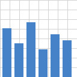

# Figure series with a repeated axis label

The section reproduces the layout of a graphical report: a series of figures
where the same axis label repeats under each figure. For the repeat detector
this is legitimate document content, not a recognition artifact.

## Figure 1

$\bar{x}$

## Figure 2

$\bar{x}$

## Figure 3

$\bar{x}$
